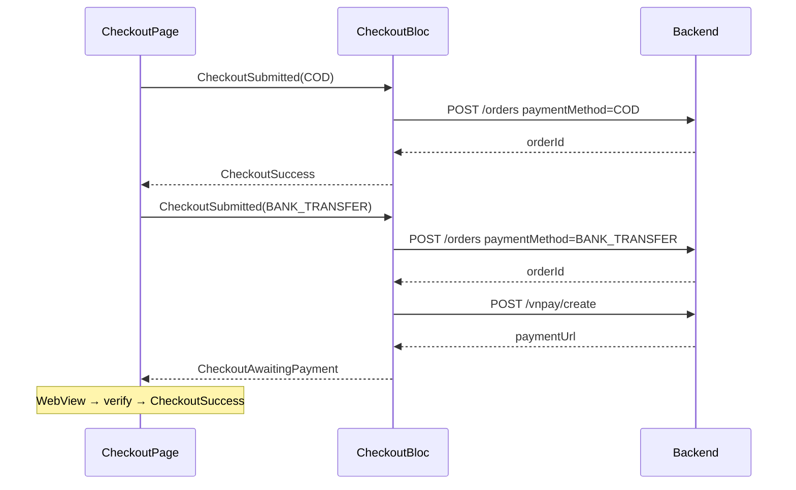

# Phase 2: CheckoutBloc — COD vs VNPay Branch

**Goal:** Sau place order, COD đi thẳng success; VNPay giữ flow WebView + verify hiện tại.

**Covers:** US-2, US-3 (P1)

**Dependencies:** Phase 1

---

## Tasks

### 1. `OrderRequestEntity` default

- [ ] Đổi default `paymentMethod` từ `'BANK_TRANSFER'` → `'COD'` **hoặc** bỏ default (required) để tránh submit thiếu method
- [ ] Đảm bảo `OrderRequestModel.toJson()` vẫn gửi `paymentMethod`

### 2. `CheckoutBloc._onSubmitted` branch

- [ ] Sau `placeOrder` success, đọc `event.request.paymentMethod`:
  ```dart
  if (event.request.paymentMethod == 'COD') {
    emit(CheckoutSuccess(orderId));
    return;
  }
  // BANK_TRANSFER → VNPay flow hiện tại
  final paymentResult = await _createVnpayPaymentUseCase(orderId);
  ...
  ```
- [ ] Không gọi `createVnpayPayment` khi COD
- [ ] `CheckoutPage` listener `CheckoutSuccess` → `loadCart` + `goNamed(checkoutSuccess)` — đã có, hoạt động cho cả COD

### 3. Edge cases

- [ ] Payment method không hợp lệ → `CheckoutFailure('Phương thức thanh toán không hợp lệ.')`
- [ ] COD: cart cleared server-side ngay khi place order — `loadCart` sau success đúng
- [ ] VNPay: cart vẫn defer đến IPN — không đổi behavior

### 4. Manual verification

- [ ] COD: place order → không mở WebView → success page
- [ ] VNPay: place order → WebView → deep link → verify → success
- [ ] Hủy VNPay WebView → snackbar lỗi như hiện tại

---

## Flow



---

## Acceptance Criteria

1. COD không trigger VNPay WebView
2. VNPay flow không regression so với hiện tại
3. `flutter analyze` clean
4. Cart refresh đúng sau COD success (giỏ trống các item đã order)

---

## Files

| Action | Path |
|--------|------|
| MODIFY | `lib/features/checkout/presentation/bloc/checkout_bloc.dart` |
| MODIFY | `lib/features/checkout/domain/entities/order_request_entity.dart` |
