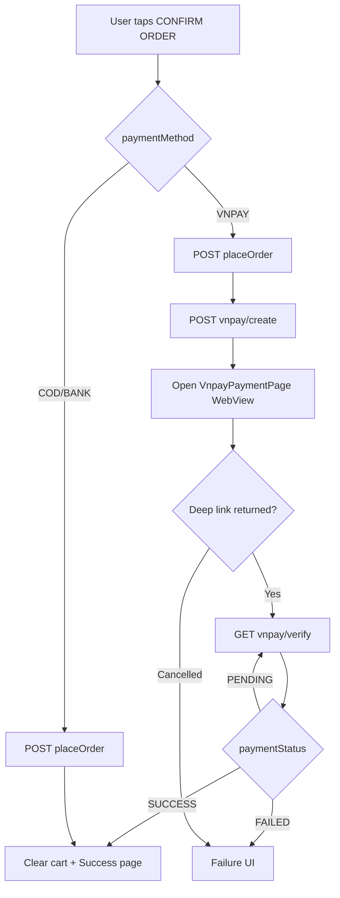

# Phase 4: Flutter — Checkout BLoC Wire (Place Order + VNPay)

**Goal:** Checkout gọi API thật; luồng VNPay end-to-end từ cart → WebView → verify → success.

**Covers:** US-1, US-5 (P1); US-7, US-8 (P2)

**Dependencies:** Phase 1, 2, 3

---

## Tasks

### API Constants
- [ ] Sửa `ApiConstants.orders` → `/api/v1/orders`
- [ ] Thêm:
  - `vnpayCreate = '/api/v1/payments/vnpay/create'`
  - `vnpayVerify(int orderId) => '/api/v1/payments/vnpay/verify/$orderId'`

### Data Layer (checkout + payment)
- [ ] `OrderRequestModel` — map `shippingAddress`, `phoneNumber`, `paymentMethod`, `cartItemIds?`, `couponCode?`
- [ ] `CheckoutRemoteDataSource` — `placeOrder`, `createVnpayPayment`, `verifyVnpayPayment`
- [ ] `CheckoutRepositoryImpl` implements `CheckoutRepository`
- [ ] Use cases: `PlaceOrderUseCase`, `CreateVnpayPaymentUseCase`, `VerifyVnpayPaymentUseCase`

### CheckoutBloc
- [ ] Sealed states: `CheckoutInitial`, `CheckoutLoading`, `CheckoutReady`, `CheckoutPlacing`, `CheckoutAwaitingPayment`, `CheckoutVerifying`, `CheckoutSuccess`, `CheckoutFailure`
- [ ] Events: `SubmitCheckout`, `PaymentReturned`, `RetryVerify`
- [ ] Flow VNPay:
  1. `SubmitCheckout` → validate form → `placeOrder(VNPAY)` → emit `CheckoutAwaitingPayment(orderId, paymentUrl)`
  2. UI push `VnpayPaymentPage` → nhận `VnpayPaymentResult`
  3. `PaymentReturned` → `verifyVnpayPayment(orderId)` — poll tối đa 3 lần, delay 2s nếu PENDING
  4. SUCCESS → `CheckoutSuccess` → navigate success page, clear cart
  5. FAILED → `CheckoutFailure` với message
- [ ] ~~COD/BANK_TRANSFER~~ — out of scope; checkout chỉ VNPay

### UI Updates
- [ ] `checkout_page.dart` — VNPay là phương thức duy nhất (bỏ/ẩn selector khác)
- [ ] Thay mock `clearCart` + `goNamed(checkoutSuccess)` bằng `BlocListener`
- [ ] `BlocProvider<CheckoutBloc>` trong router checkout route
- [ ] DI: register factory `CheckoutBloc`, datasource, repo, use cases

### OrderRequestEntity alignment
- [ ] Cập nhật entity: thêm `phoneNumber`, `cartItemIds`, bỏ `userId` (backend lấy từ JWT)

---

## Checkout Flow (VNPay)

---

## Files

| Action | Path |
|--------|------|
| MODIFY | `lib/core/constants/api_constants.dart` |
| CREATE | `lib/features/checkout/data/models/order_request_model.dart` |
| CREATE | `lib/features/checkout/data/models/order_response_model.dart` |
| CREATE | `lib/features/checkout/data/datasources/checkout_remote_datasource.dart` |
| CREATE | `lib/features/checkout/data/repositories/checkout_repository_impl.dart` |
| CREATE | `lib/features/checkout/domain/usecases/place_order_usecase.dart` |
| CREATE | `lib/features/checkout/domain/usecases/create_vnpay_payment_usecase.dart` |
| CREATE | `lib/features/checkout/domain/usecases/verify_vnpay_payment_usecase.dart` |
| CREATE | `lib/features/checkout/presentation/bloc/checkout_bloc.dart` |
| CREATE | `lib/features/checkout/presentation/bloc/checkout_event.dart` |
| CREATE | `lib/features/checkout/presentation/bloc/checkout_state.dart` |
| MODIFY | `lib/features/checkout/presentation/pages/checkout_page.dart` |
| MODIFY | `lib/features/checkout/domain/entities/order_request_entity.dart` |
| MODIFY | `lib/core/di/injection_container.dart` |
| MODIFY | `lib/app/router/app_router.dart` |

---

## Acceptance Criteria

1. Chọn VNPay → place order → WebView mở → deep link → verify → success page
2. Chọn COD → place order → success (không WebView)
3. Verify trả PENDING → retry → SUCCESS khi IPN đến
4. API error hiển thị SnackBar/message rõ ràng
5. Cart cleared chỉ khi verify SUCCESS (backend đã clear cart ở IPN; Flutter refresh cart từ API)
6. `flutter analyze` + widget test cơ bản CheckoutBloc state transitions
