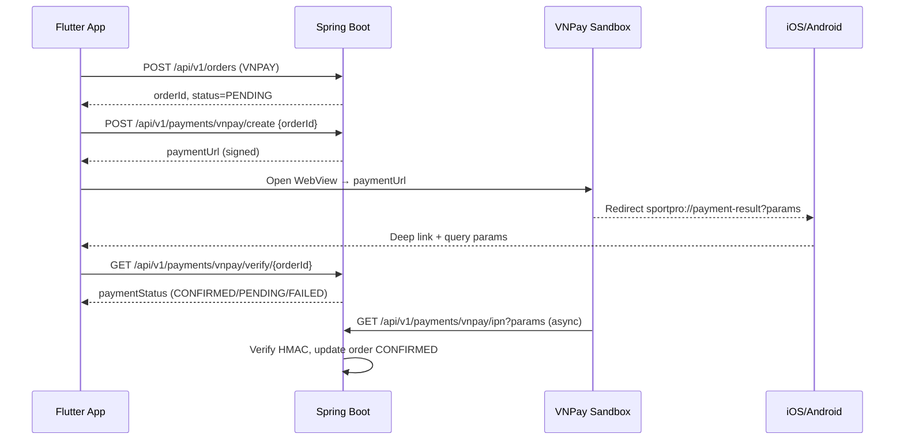

# Plan: VNPay Sandbox Payment — Flutter Mobile + Spring Boot
Status: 🟢 Implemented (pending E2E on device)
Date: 2026-06-09
Mode: Hard
Test: default

## Decisions (user confirmed)

| # | Decision |
|---|----------|
| Q1 | Deep link: `sportpro://payment-result` (agent choice) |
| Q2 | **Defer cart clear + stock deduct** cho VNPAY đến khi IPN success |
| Q3 | TMN_CODE + HASH_SECRET + IPN URL đã có sẵn trên VNPay portal |
| Q4 | Checkout **chỉ VNPay** — không wire COD/BANK_TRANSFER |
| Q5 | Test ưu tiên **Android emulator** (Android Studio) |

## Overview
Triển khai luồng thanh toán VNPay môi trường sandbox cho ứng dụng Flutter. Khác với web, **Return URL** là Deep Link (`sportpro://payment-result`) để OS bắt redirect từ In-App WebView và mở lại app kèm query params. Backend xác thực giao dịch qua **IPN** (nguồn sự thật); app chỉ gọi API verify để hiển thị UX.

---

## Scope Challenge

```
# Scope Challenge:
#   Exists?     → Backend: PaymentMethod/docs nhắc VNPAY nhưng chưa có module ❌
#                 → Flutter: checkout mock-only, chưa deep link ❌
#   Minimum?    → Place order VNPAY → WebView sandbox → deep link → IPN confirm → UI result
#   Complexity? → Hard — 2 repos, security (HMAC), deep link đa nền tảng, order state
#
# Mode: Hard
# Test: default
```

> Không có brainstorm report riêng cho VNPay. User đã mô tả rõ deep link flow → tiếp tục plan.

---

## User Stories

### P1 — Must Have
- **US-1**: User chọn VNPay tại checkout và đặt hàng (POST `/api/v1/orders` với `paymentMethod: VNPAY`).
- **US-2**: App nhận `paymentUrl` từ backend và mở trang VNPay sandbox trong In-App WebView.
- **US-3**: Sau thanh toán, VNPay redirect về `sportpro://payment-result?...` → OS mở app, đóng WebView.
- **US-4**: Backend nhận IPN (`GET /api/v1/payments/vnpay/ipn`), verify chữ ký HMAC-SHA512, cập nhật order `CONFIRMED` hoặc giữ `PENDING`/`CANCELLED`.
- **US-5**: App gọi `GET /api/v1/payments/vnpay/verify/{orderId}` và hiển thị màn success/failure.

### P2 — Should Have
- **US-6**: Xử lý user hủy thanh toán hoặc thất bại (`vnp_ResponseCode != 00`).
- ~~**US-7**~~: Out of scope — checkout chỉ VNPay.
- **US-8**: Order detail hiển thị phương thức VNPAY và trạng thái thanh toán.

### P3 — Nice to Have
- **US-9**: Job tự hủy đơn VNPay quá hạn chưa thanh toán + hoàn stock.
- **US-10**: Admin order detail hiển thị `vnp_TxnRef` / mã giao dịch.

---

## Research Summary

### Primary (RECOMMEND)
| Layer | Quyết định |
|-------|-----------|
| Backend module | `modules/payment/vnpay/` — config, service ký/verify, controller |
| Return URL | Deep link trực tiếp: `sportpro://payment-result` (sandbox chấp nhận custom scheme) |
| IPN | Public GET endpoint, verify hash, update order — **nguồn sự thật** |
| Stock + cart | **Defer** cho VNPAY: chỉ trừ stock + xóa cart khi IPN `ResponseCode=00` |
| Flutter WebView | `webview_flutter` — intercept `shouldOverrideUrlLoading` khi URL bắt đầu `sportpro://` |
| Deep link | Custom scheme + `app_links`; Android intent-filter + iOS CFBundleURLTypes |
| txnRef | `{orderId}_{timestamp}` lưu trên Order |

### Alternative (đã xem xét)
| Phương án | Verdict |
|-----------|---------|
| Bridge HTML page redirect → deep link | **Dự phòng** nếu sandbox từ chối custom scheme URL |
| Bảng `payments` riêng | **Reject MVP** — thêm cột `vnp_txn_ref` trên `orders` đủ |
| `flutter_vnpay_sdk` | **Reject** — ít kiểm soát deep link flow |
| Universal Links | **Reject MVP** — phức tạp; custom scheme đủ sandbox |
| Trừ stock sau khi IPN success | **P3** — refactor lớn, khác flow hiện tại |

---

## Architecture



---

## Phases
- [x] Phase 1: Backend — VNPay config + create payment URL
- [x] Phase 2: Backend — IPN callback + verify API + order status
- [x] Phase 3: Flutter — Deep link + WebView payment screen
- [x] Phase 4: Flutter — Checkout BLoC wire (place order + VNPay flow)
- [ ] Phase 5: Integration verification (sandbox E2E — manual on Android emulator)

## Session Notes
<!-- Updated by cook automatically — do not edit manually -->

**Last active:** 2026-06-09
**Phase in progress:** phase-05-integration-verification
**Status:** Code complete; E2E sandbox test pending on Android emulator

### Decisions made this session
- Defer stock/cart/coupon usedCount for VNPAY until IPN `ResponseCode=00`
- Deep link scheme `sportpro://payment-result`
- Checkout chỉ VNPay; verify polls up to 3× (2s delay) if PENDING
- Coupon `usedCount` also deferred for VNPAY orders

### Next immediate action
- Add VNPAY_* vars to `.env`, start backend, run Android emulator E2E per phase-05 checklist

---

## Story ↔ Phase Mapping

| Phase | P1 | P2 | P3 |
|-------|----|----|-----|
| 1 | US-1 | — | — |
| 2 | US-4, US-5 | US-6, US-8 | US-10 |
| 3 | US-2, US-3 | US-6 | — |
| 4 | US-1, US-5 | US-8 | — |
| 5 | all verify | US-6–8 | — |

---

## API Endpoints (mới)

| Method | Path | Auth | Mô tả |
|--------|------|------|-------|
| POST | `/api/v1/payments/vnpay/create` | JWT | Tạo URL thanh toán cho order |
| GET | `/api/v1/payments/vnpay/ipn` | Public | VNPay IPN callback |
| GET | `/api/v1/payments/vnpay/verify/{orderId}` | JWT | App xác nhận trạng thái sau deep link |

---

## Config (env)

```properties
# application-dev.yml (không commit secret thật)
vnpay.tmn-code=VNPAY_TMN_CODE
vnpay.hash-secret=VNPAY_HASH_SECRET
vnpay.pay-url=https://sandbox.vnpayment.vn/paymentv2/vpcpay.html
vnpay.return-url=sportpro://payment-result
vnpay.ipn-url=https://{ngrok-host}/api/v1/payments/vnpay/ipn
```

---

## Risks

| Risk | Severity | Mitigation |
|------|----------|------------|
| IPN cần URL public — localhost không nhận | HIGH | Dùng ngrok khi dev; document trong phase 5 |
| Deep link không bắt trên một số device | MEDIUM | Test Android + iOS; fallback bridge HTML redirect |
| Stock đã trừ nhưng user không thanh toán | MEDIUM | P3: expire job; hiện tại chấp nhận cho sandbox |
| VNPay sandbox từ chối custom scheme Return URL | MEDIUM | Phase 2 thêm bridge endpoint redirect |
| Race: deep link trước IPN | LOW | Verify API trả PENDING → app poll/retry 2–3 lần |
| ApiConstants.orders sai path (`/orders`) | HIGH | Sửa thành `/api/v1/orders` ở phase 4 |
| ~~Cart cleared before payment~~ | — | **Resolved:** defer cart + stock cho VNPAY (Q2) |
| Cart Cubit local vs server desync | MEDIUM | Phase 4: refresh cart sau IPN success; không clear local khi place order VNPAY |

### Red-Team Review (self-review — agents unavailable)

| Finding | Verdict |
|---------|---------|
| IPN là nguồn sự thật, không trust deep link params | ACCEPTED — đã có trong plan |
| Bridge return URL dự phòng nếu sandbox reject custom scheme | ACCEPTED — phase 2 |
| Không tách bảng `payments` cho MVP | ACCEPTED — `vnp_txn_ref` trên orders đủ |
| Cart cleared server-side trước khi thanh toán VNPay xong | NOTED — cần quyết định user (Q2) |
| Thiếu `phoneNumber` trong Flutter `OrderRequestEntity` | ACCEPTED — phase 4 bổ sung |
| Dùng `PENDING` cho unpaid VNPAY (không thêm enum mới) | ACCEPTED |
| `CREDIT_CARD` enum tồn tại nhưng chưa dùng — VNPAY tách riêng | NOTED — không map CREDIT_CARD → VNPAY |

---

## Files chính

### Backend (`be-ecommerce`)
- `modules/payment/vnpay/config/VnpayProperties.java`
- `modules/payment/vnpay/service/VnpayService.java`
- `modules/payment/vnpay/controller/VnpayController.java`
- `modules/order/enums/PaymentMethod.java` — thêm `VNPAY`
- `modules/order/domain/Order.java` — thêm `vnpTxnRef`
- `config/SecurityConfig.java` — public IPN path

### Flutter (`flutter-ecommerce`)
- `lib/features/payment/` — data/domain/presentation
- `lib/features/checkout/presentation/bloc/checkout_bloc.dart`
- `android/.../AndroidManifest.xml` — intent-filter
- `ios/Runner/Info.plist` — CFBundleURLTypes
- `pubspec.yaml` — `webview_flutter`, `app_links`
